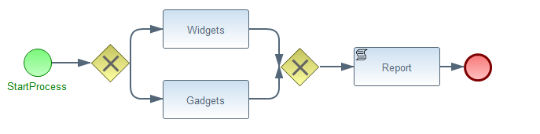

JBPM Example
============

At a high level this simple jBPM example aims to show how create and implement a simple Business Process using jBPM. 

This example aims to show the common APIs you must interact with; Such as creating KnowledgeBases in order to create new StatefulKnowledgeSessions, Testing, and taking advantage of Persistence.

Solution Overview
--------

The business process requires for Orders to be sent in a different path dependant on the type of Product the order contains. The two types of Product which may be contained within an order are Widgets, and Gadgets.

	

Work Item Handlers
------------------

A custom Service Task requires for you to register a 'WorkItemHandler' instance with the current StatefulKnowledgeSession you have instantiated.

The following custom WorkItemHandlers are registered within this example;

- Widget Service
    - This specific WorkItemHandler implementation shows how a WorkItem may be completed immediately.

- Gadget Service
    - Represents a WorkItemHandler which may take an unknown amount of time to process and complete, and will therefore complete the WorkItem asynchronously.

Running The Example
===================

Prerequisites
--------------

To run these examples you will require the following tools; Your version numbers may differ, however I have provided mine
at the time of writing.

- [Ant](http://ant.apache.org/) 1.9.2
- [Maven](http://maven.apache.org/) 3.1.0
- [JBPM Installer](http://sourceforge.net/projects/jbpm/files/jBPM%205/jbpm-5.4.0.Final/) - 5.4.0.Final
- [MySQL](http://dev.mysql.com/downloads/mysql/5.1.html) mysql-5.1.71
- [Eclipse](http://www.eclipse.org/downloads/download.php?file=/technology/epp/downloads/release/juno/SR2/eclipse-jee-juno-SR2-win32.zip) JEE Juno SR2
    - [BPMN 2.0 Modeler Plugin](http://www.eclipse.org/bpmn2-modeler/) 0.2.5
    - Redhat JBoss Developer Studio Juno Marketplaces 6.0 Marketplace
- [IntelliJ](http://www.jetbrains.com/idea/) 12.1.4

### MySQL

Within MySQL Create two new databases and users, for both jbpm5 and user tasks.

    CREATE SCHEMA IF NOT EXISTS jbpm5;
    CREATE USER 'jbpm5'@'localhost' IDENTIFIED BY 'jbpm5';
    GRANT ALL PRIVILEGES ON jbpm5.* TO 'jbpm5'@'localhost';

    CREATE SCHEMA IF NOT EXISTS task;
    CREATE USER 'task'@'localhost' IDENTIFIED BY 'task';
    GRANT ALL PRIVILEGES ON task.* TO 'task'@'localhost';

This will allow you to connect to the schema with the given connection string

    jdbc:mysql://localhost:3306/jbpm5

*Note* - Hibernate will automatically create the required tables on application start. This process should not be performed manually.

Running The demo
----------------

###Application Startup

After you have installed all of the prerequisites.

Run the JBPM instance

    cd jbpm-install
    ant install.demo.noeclipse
    ant start.demo.noeclipse

If you are having issues with the installer, be sure to look at the readme under `${JBPM_INSTALL_HOME}/install.html`

TODO ...

Useful Resources
=========

- [JBPM Community Training](http://salaboy.com/2011/01/24/announcing-jbpm5-community-training/)
- [JBPM5 Developer Guide](http://www.packtpub.com/jboss-business-process-management-5-jave-developer-guide/book)